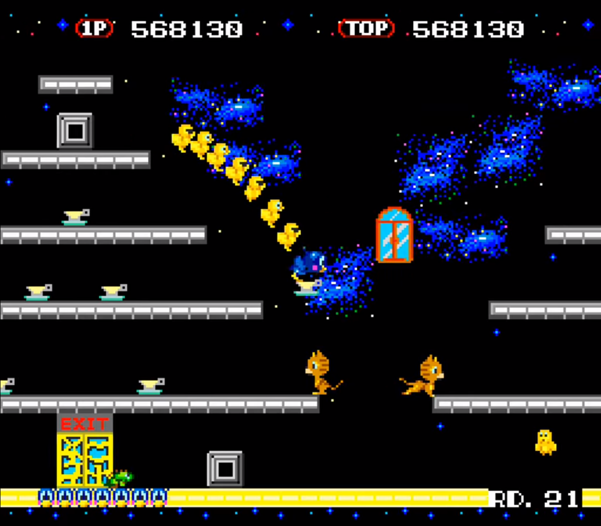
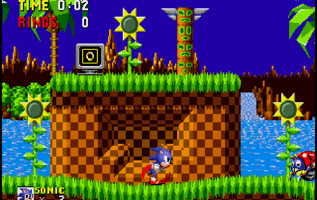

# Red - A arara

   Red a Arara é um jogo de plataforma Side Scrolling com câmera que mostra a lateral do jogo, em que Red o personagem protagonista, deve procurar pela família perdida e salvá-los da venda ilegal de aves silvestres na floresta amazônica. 

## Descrição
- `Gênero` Ação e aventura
- `Tema` Ambiente florestal
- `Câmera` 2D - Side-scrolling
- `Estilo` Pixel art e cartoon
- `Objetivo` O objetivo é vencer os inimigos, coletar buritis (fruto do jogo) e passar pelas fases até chegar a fase final e salvar outras araras da venda ilegal.

## Engine
- `IDE` Unity 
- `Versão` 2019.4.1f1
- `Linguagem` C#

## Referências

- Gameplay 
**Flicky**

- Artísticas de Gameplay
**Sonic The Hedgehog**

